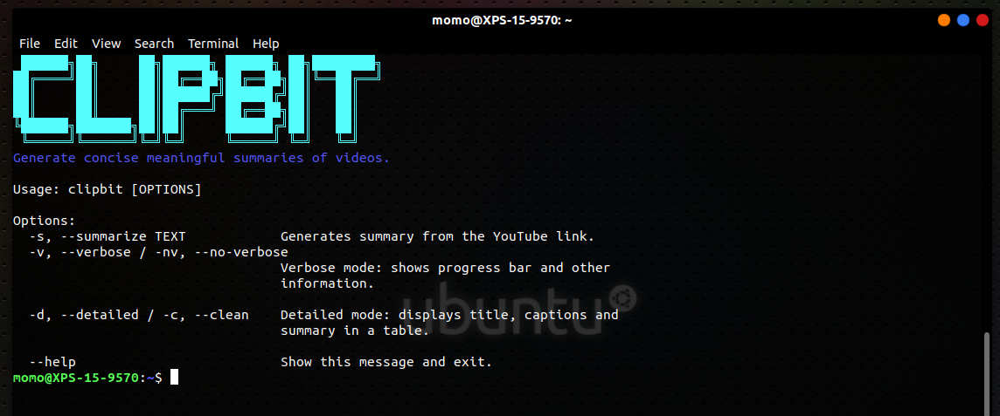
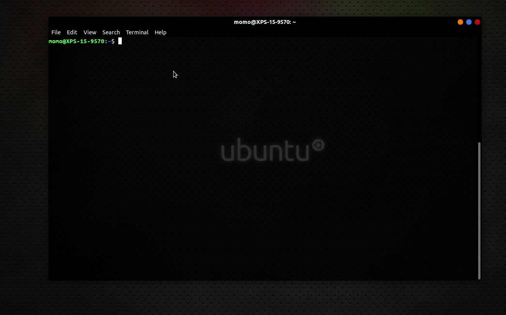

## Introduction

[ClipBit](https://pypi.org/project/clipbit/1.0.0/) is a CLI tool developed to generate an abstractive text summary of youtube videos. All you need to provide is a link to a Youtube
video of your choice and the program will give a text summary.

## Installation
```
pip install clipbit
```

## Basic Usage
To know more about the program and the flags available, run the help command by running `clipbit --help`.


To summarize a youtube video, grab the link and feed to the CLI program as demonstrated in the gif below


## Future add-ons

1. Generate summaries for videos with no captions.
2. Generate summaries for longer videos exceeding 1 hour.
3. Workaround NLP model limit of 512 Tokens.
4. GUI or web-app

## Authors

Meet the ClipBit team
1. [Miguel Guardia](https://github.com/Miguel-Enrique13)
2. [Sarthak Khattar](https://github.com/m0mosenpai)
3. [Kimaru Thagana](https://github.com/KimaruThagna)

## License 
[](https://opensource.org/licenses/MIT) <br>
ClipBit is free and open source under the MIT License.

